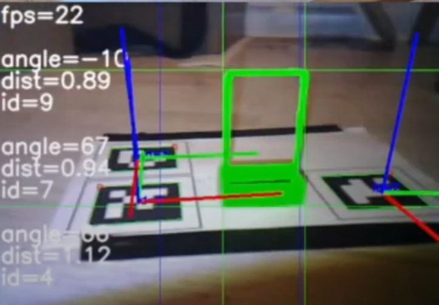

# Vision Based Autonomous Robot

This repo contains source code used for task 3 of Robot Control course at the University of Warsaw. 
The goal of is to control a robot based on images from its camera. There are two tasks:

## Markers in 3D
The robot is given a list of ids of aruco markers and it should visit all of them in the correct order.
Markers are vertical and they should be approached from the front. `markers_in_3d.py` solves this task. 
The video showing the robot solving that task can be found [here](https://www.youtube.com/watch?v=CyPLnPHp77g)

## Moving baskets
The robot should find a basket, which is placed next to an aruco marker, then it should pick up the basket
and put it next to the correct aruco marker depending on the color of the basket. `moving_baskets.py` solves this task.
The video showing the robot solving that task can be found [here](https://www.youtube.com/watch?v=-0iYvFh_LDE)
